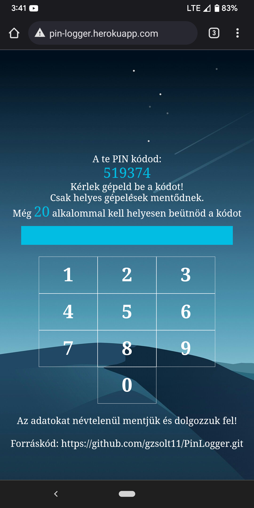

# SapiPin

The dataset was collected in 2021 in an uncontrolled environment and contains 6-digit PIN typing of 112 voluntary participants.
Each subject typed in a randomly generated 6-digit PIN code 20 times on his/her own mobile device.
A publicly available web application was used for data collection [https://pin-logger.herokuapp.com](https://pin-logger.herokuapp.com),
which works only from mobile devices. The data collector app was developed by Zsolt Gergely [https://github.com/gzsolt11/PinLogger](https://github.com/gzsolt11/PinLogger).

The subjects agreed to the use of their data for scientific experiments by sending themselves the collected data to a designated e-mail address.
The keyboard layout of this data collector is shown in Fig. .
